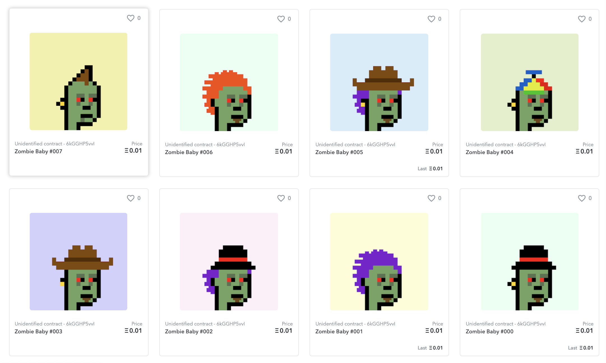

<kbd></kbd>

 

# BokkyPooBah's ERC-1155 NFT

Based on [OpenZeppelin v4.0.0](https://github.com/OpenZeppelin/openzeppelin-contracts/releases/tag/v4.0.0)

 

# Deployment

Deployed [deployed/BokkyPooBahsNFT_0xFe9231f0e6753a8412a00eC1f0028A24d5220Ba9.sol](deployed/BokkyPooBahsNFT_0xFe9231f0e6753a8412a00eC1f0028A24d5220Ba9.sol) to [0xfe9231f0e6753a8412a00ec1f0028a24d5220ba9](https://etherscan.io/address/0xfe9231f0e6753a8412a00ec1f0028a24d5220ba9#code)

 

# Gas Cost

Deployment 2,723,345 gas or 0.307737985 ETH ($647.70) @ 113 gwei - [0xc96dd37615da084d747df11cd7e200a92731923ad8658a3a529cf89beadfab35](https://etherscan.io/tx/0xc96dd37615da084d747df11cd7e200a92731923ad8658a3a529cf89beadfab35).

Minting a single token 49,739 gas or 0.006714765 ETH ($14.13) @ 135 gwei - [0x22c6cd9fef39926e2085c5c908add74c44fefb2a9defaf2392d6b868831f4b6e](https://etherscan.io/tx/0x22c6cd9fef39926e2085c5c908add74c44fefb2a9defaf2392d6b868831f4b6e)

Transfer 8 tokens 229,658 gas or 0.024343748 ETH ($48.85) @ 106 gwei - [0x96fcad275d622891fd344453a72147c81e98bc953433a06cc8631112a0075668](https://etherscan.io/tx/0x96fcad275d622891fd344453a72147c81e98bc953433a06cc8631112a0075668)

 

 

Enjoy!

(c) BokkyPooBah / Bok Consulting Pty Ltd - Apr 8 2021. The MIT Licence.
